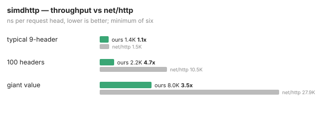

# simdhttp

A request-head parser for HTTP/1.1 built on [simd.go](https://github.com/sebishogun/simd):
classify the bytes a vector register at a time, then walk the boundaries
instead of the bytes — the two-stage shape simdjson proved on JSON,
applied to a format whose structure is even simpler.

**What ships today:** only the borrowed-buffer request-head parser described
below. There is no router, no body framing, no middleware, and no server.
The approved production design ([architecture](docs/architecture.md),
[roadmap](docs/roadmap.md)) is planned, not built.

## The parser

```go
var req simdhttp.Request
req.Headers = make([]simdhttp.Header, 0, 16) // reused across calls
n, err := simdhttp.Parse(&req, buf)
```

`Parse` reads exactly one request head — the request line and the header
block through the terminating blank line — from the start of `buf`.

- `Request` carries `Method`, `Target`, `Proto`, and `Headers`.
- Every field aliases the input buffer; after warmup, `Parse` allocates
  nothing for heads no larger than the largest one parsed so far — the
  `lineEnds` scratch and the `Headers` backing array grow on demand when
  a larger head arrives, and are then reused. The caller owns the bytes
  and their lifetime.
- `Header.Name` is the name as written (not canonicalized); `Header.Value`
  is the value with optional whitespace trimmed.
- `consumed` counts bytes through the terminating blank line.
- `ErrIncomplete` means the head is not terminated yet: read more and call
  again. `ErrMalformed` means the bytes cannot be an HTTP/1.x head. On
  either error, `consumed` is 0 and the request must not be used.
- A `Request` is not safe for concurrent use: `Parse` reuses its scratch.

The version must be exactly `HTTP/1.0` or `HTTP/1.1` — a deliberate
restriction (deviation D10: Go's reader accepts any single-digit
`HTTP/X.Y`, and the server also accepts the `PRI * HTTP/2.0` preface).
Methods and header names must be RFC 9110 tokens; header values may not
contain control bytes other than HTAB; and line endings must be CRLF.
Request-target semantics are the caller's job (net/url), not this
package's — today the parser does not even check the target for control
bytes or invalid percent-escapes (see the gap table below).

## Contract with net/http

Accepted heads are checked against `net/http`'s `ReadRequest` on a corpus
and under differential fuzz: anything the standard reader rejects (within
the documented scope — net/url target semantics excluded), this rejects,
and accepted requests carry byte-identical fields with OWS trimmed. (The
test's random-mutation loop is a no-panic smoke, not a verdict comparison:
it never asserts an outcome.) Where simdhttp is deliberately stricter than
Go — bare-LF line endings, spaces inside field names, obs-fold
continuations, and the future Host/CL policy — each deviation is
enumerated in the canonical list, [docs/architecture.md §2.1](docs/architecture.md).

## Known safety and compatibility gaps

Verified against the source and net/http on 2026-08-13 (Go 1.26.5). None of
these are fixed yet; the current parser is a parsing primitive, not a
hardened front door. Do not put this parser in front of an origin without
addressing them.

| gap | what happens today | Go 1.26.5 |
|---|---|---|
| Long header-value control bytes | a value ≥ 64 bytes whose first HTAB precedes a control byte (NUL, DEL, …) slips the control scan — the kernel returns the tab, the guard passes, the scan stops | rejects |
| Duplicate `Host` | any second `Host` line is accepted, even an identical one | rejects ("too many Host headers") |
| Missing / malformed `Host` | an HTTP/1.1 head with no `Host`, an empty `Host:`, or a malformed host is accepted | server rejects missing and malformed Host; a present-but-empty `Host:` is accepted |
| Request-target controls and escapes | NUL, DEL and other control bytes, and invalid percent-escapes (`%zz`, `%2`), are accepted in the target | rejects (net/url control-character and escape checks) |
| `Content-Length` framing | `Content-Length` + `Transfer-Encoding` together, and any duplicate `Content-Length`, are accepted | `ReadRequest` and the server both accept CL+TE by deleting `Content-Length` and framing chunked; rejects *differing* duplicate `Content-Length`, dedupes identical ones |
| Body / chunked / trailers | not parsed at all — no framing, no `BodyReader` | full framing |
| Limits | none: unbounded head size, header count, value length | server head bounded by `MaxHeaderBytes` (default 1 MiB) |

The differential fuzz's one-direction contract (never accept what net/http
rejects) has held for 35M+ executions, but it cannot pass judgment it never
reaches: the long-value case above needs a ≥ 64-byte value that its short
seeds do not grow into.

## Speed (historical)



The chart and table are **historical measurements from August 2026 on
amd64/AVX-512** — this machine, this toolchain, the code at commit `5c2bee2`.
They are evidence for the sweep-then-fix story below, not a compatibility
promise for any other machine.

Two provenance notes on the frozen SVG (`docs/bench.svg` cannot change):

- the quoted numbers are the **min-of-three** runs recorded with the
  original README (`a60a44b` measured the typical head; `530ac05` shipped
  the four-shape table); the SVG's caption saying "minimum of six" is a
  drawing-time slip that predates the `-count=6` Makefile target;
- the SVG rounds ratios for display: the typical row's 1.05× renders as
  "1.1×". The **table above is authoritative**; `make bench` (one process,
  shuffled, `-count=6`) is today's reproduction command, not the source
  of the quoted numbers, and may differ on any machine or day.

| shape | simdhttp | net/http | |
|---|---|---|---|
| typical 9-header | ~1,400 | ~1,470 | 1.05× |
| 100 headers | **2,219** | 10,491 | **4.7×** |
| giant header value | **8,032** | 27,893 | **3.5×** |

The 100-header row is the sweep-then-fix story: a first cut lost it 1.3×
because per-header work called kernels on sub-threshold slices where
dispatch dominates. One `IndexAll` pass finds every line end; the colon and
short-line validation are then compiler intrinsics and inline loops, no
dispatch. The giant-value win is aliasing — net/http copies the value, this
returns a sub-slice. The fix reversed the typical shape from 1.22× to 1.05×
(the record is in [docs/wrong.md](docs/wrong.md)).

Pure Go, no cgo in the dependency path: simd ships its kernels as committed
assembly, so this is an ordinary `go get`.

## Roadmap

The approved production target — a net/http-native low-allocation router,
streaming body framing, helpers, and middleware, with safety work staged
first — is specified in [docs/roadmap.md](docs/roadmap.md). Until the
roadmap's Phase 0 lands, treat the parser as internally consistent but not
yet hardened.
